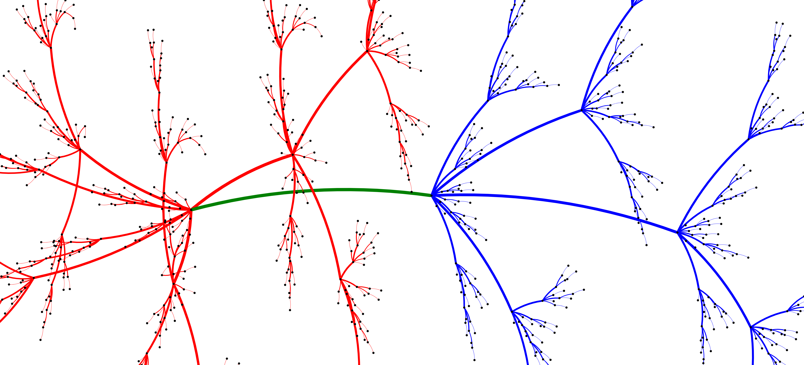

# Treebonacci

Construction of a family of Fibonacci-type trees that arise in the study of sparse amoeba graphs. Concretely, it is the first example of an infinite family of global amoebas with arbitrary maximum degree ([2, Section 3]).

Recently, it was found that these trees are actually *local* amoebas, which is stronger (see [1]). That project was in part inspired by the computations present in this repository.

## References

[1] <a href="http://arxiv.org/abs/2311.17182">Eslava, L., Hansberg, A., _, Ventura, D., *New recursive constructions of amoebas and their balancing number*, **preprint**, 2023.</a> 

[2] <a href="https://www.combinatorics.org/ojs/index.php/eljc/article/download/v30i3p9/pdf/">Caro, Y., Hansberg, A., Montejano, A. (2023). *Graphs isomorphisms under edge-replacements and the family of amoebas*. **Electronic Journal of Combinatorics 30(3) P3.9**</a> 
